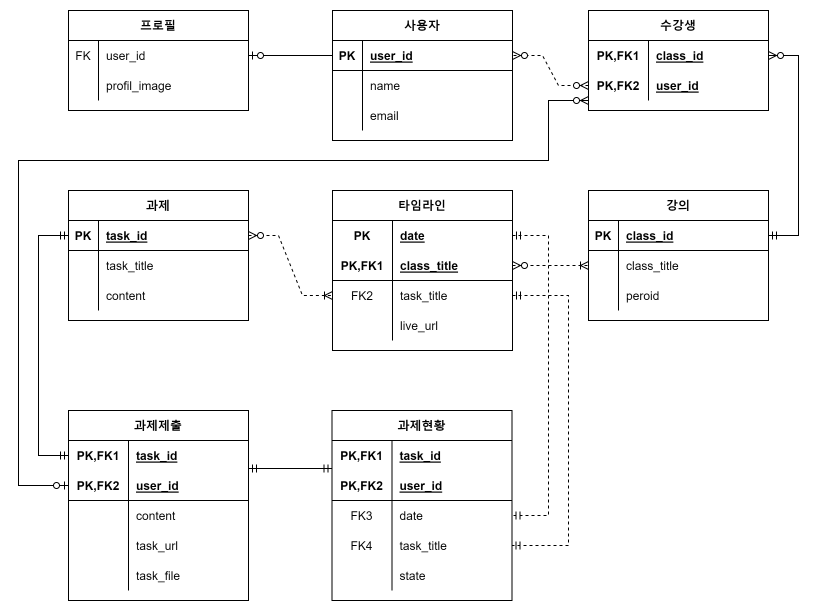
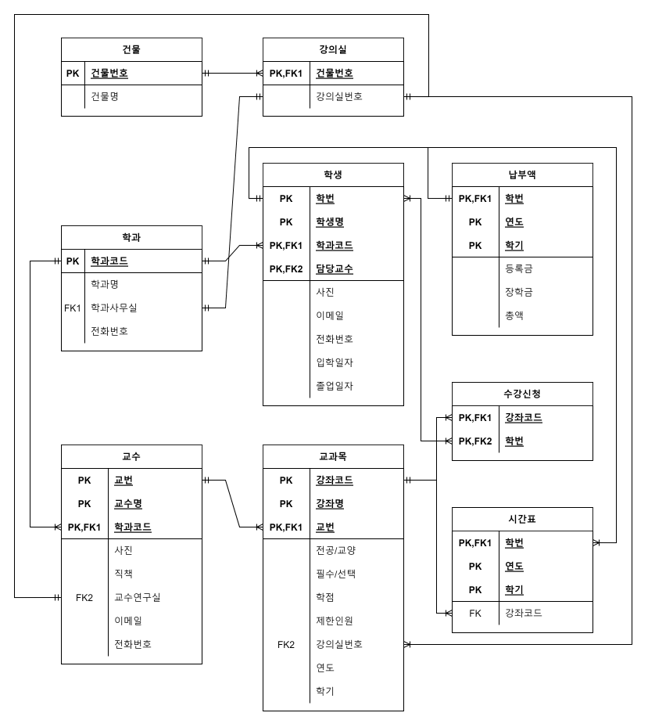

## ERD 작성하기

### 1. Syllaverse

> Syllaverse의 커리큘럼 탭을 보고 어떤 구조인지 ERD를 자유롭게 그려봅시다.

- 사용자
  - 사용자id(user_id) - 기본, 필수
  - 이름(name) - 필수
  - 이메일(email) - 필수
- 프로필
  - 사용자id(user_id) - 참조
  - 프로필사진(profil_image)
- 강의
  - 강의id(class_id) - 기본, 필수
  - 강의명(class_title) - 필수
  - 기간(period) - 필수
- 과제
  - 과제id(task_id) - 기본, 필수
  - 과제명(task_title) - 필수
  - 내용(content) - 필수
- 수강생
  - 강의id(class_id) - 기본, 참조, 필수
  - 사용자id(user_id) - 참조, 필수
- 타임라인
  - 날짜(date) - 기본, 필수
  - 강의명(class_title) - 참조, 필수
  - 과제명(task_title) - 참조
  - 라이브url(live_url)
- 과제제출
  - 과제id(task_id) - 기본, 참조, 필수
  - 사용자id(user_id) - 기본, 참조, 필수
  - 설명(content)
  - 과제url(task_url)
  - 과제file(task_file)

- 과제현황

  - 사용자id(user_id) - 기본, 참조, 필수

  - 과제id(task_id) - 기본, 참조, 필수

  - 날짜(date) - 참조, 필수

  - 과제명(task_title) - 참조, 필수

  - 제출상태(state) - 필수

### 2. 대학교 학사관리시스템

> 대학교의 학사관리시스템 기능의 ERD를 자유롭게 그려봅시다.

- 학과
  - 학과코드 - 기본, 필수
  - 학과명 - 필수
  - 학과사무실
  - 전화번호
- 건물
  - 건물번호 - 기본, 필수
  - 건물명 - 필수
- 강의실
  - 건물번호 - 기본, 참조, 필수
  - 강의실번호 - 필수
- 학생
  - 학번 - 기본, 필수
  - 학생명 - 기본, 필수
  - 학과코드 - 기본, 참조, 필수
  - 담당교수 - 기본, 참조, 필수
  - 사진
  - 이메일
  - 전화번호
  - 입학일자
  - 졸업일자
- 교수
  - 교번 - 기본, 필수
  - 교수명 - 기본, 필수
  - 학과코드 - 기본, 참조, 필수
  - 사진
  - 직책
  - 교수연구실
  - 이메일
  - 전화번호
- 교과목
  - 강좌코드 - 기본, 필수
  - 강좌명 - 기본, 필수
  - 교번 - 기본, 참조, 필수
  - 전공/교양 - 필수
  - 이수구분 - 필수
  - 학점 - 필수
  - 제한인원
  - 강의실번호 - 참조
  - 연도 - 필수
  - 학기 - 필수
- 납부액
  - 학번 - 기본, 참조, 필수
  - 연도 - 기본, 필수
  - 학기 - 기본, 필수
  - 등록금 - 필수
  - 장학금
  - 총액 - 필수
- 수강신청
  - 강좌코드 - 기본, 참조, 필수
  - 학번 - 기본, 참조, 필수
- 시간표
  - 학번 - 기본, 참조, 필수
  - 연도 - 기본, 필수
  - 학기 - 기본, 필수
  - 강좌코드 - 참조

